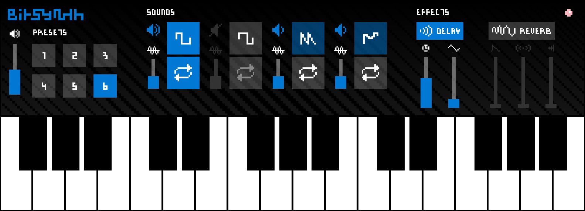
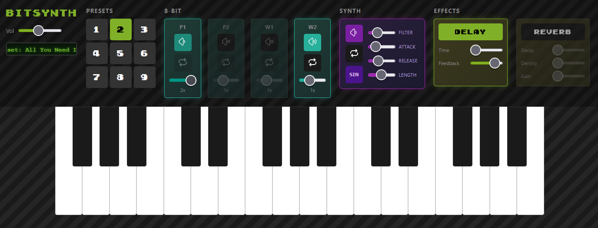

# BitSynth
In 2012, I built BitSynth, an 8-bit synthesizer for Windows Phone. Around 100k people seemed to really liked it.

In 2017, I rebuilt BitSynth as a Universal Windows app. it scaled to large Windows touch screens, and looked pretty sweet on the giant Surface Studio screen. 

Finally, in 2026, I am rebuilding BitSynth for *all* devices. This browser-based app will be available for free at [bitsynth.com](https://bitsynth.com). Like previous versions, it will be optimized for mobile devices. I hope you will follow along in its development!

